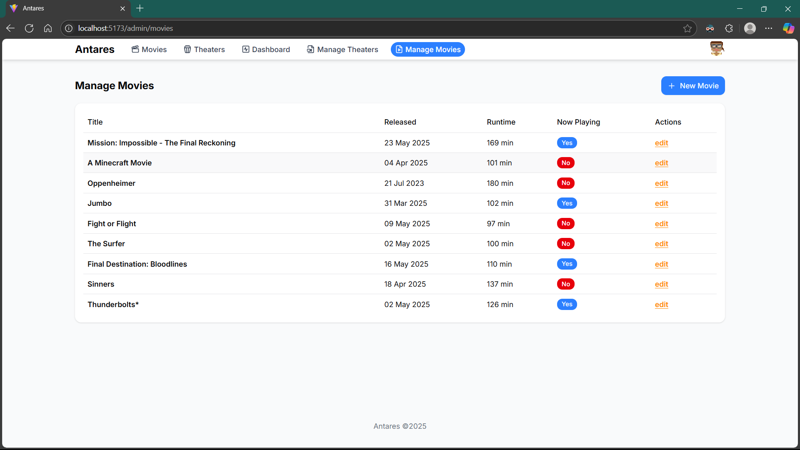

# Antares Movie Booking App

This is a movie booking app built with React and Tailwind CSS. This is the frontend of the Antares project, which is a movie booking app built with NestJS and TypeScript.

## Features

- Login and Registration
- Movie Search
- Movie Details
- Cinema Search
- Cinema Details
- Admin Panel
  - Manage Theaters
  - Manage Movies
  - Manage Showtimes

## Getting Started

To get started, follow these steps:

1. Clone the repository:

```bash
git clone https://github.com/your-username/antares-fe-react.git
```

2. Install dependencies:

```bash
npm install
```

3. Start the development server:

```bash
npm run dev
```

4. Open [http://localhost:5173](http://localhost:5173) in your browser to view the application.

## Screenshots





## Contributing

Contributions are welcome! If you find a bug or have a suggestion, please open an issue or submit a pull request.

## License

This project is licensed under the MIT License.
